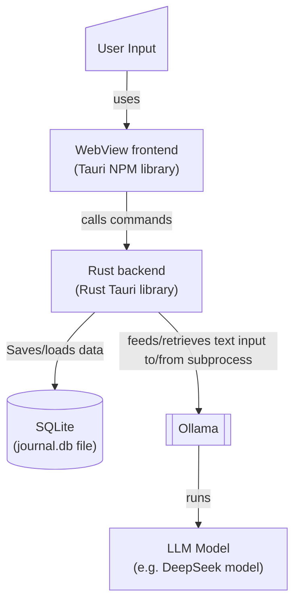

# deep-journal
Like to use LLMs, but don't want to give your chat data up to third parties? Use this. Everything runs on your machine and stores your chat data to a local SQLite database file (`journal.db`).

Technologies:
- LLM Model: deepseek-r1:1.5b (see Future section for more)
- Frontend: Svelte/TypeScript + Tauri
- Backend: Rust + Tauri
- Database: SQLite

  
## Installation
1. [Download and install Ollama CLI](https://ollama.com/download). (This is what runs the DeepSeek model.)
2. Go to GitHub Releases page and run the `deep-journal` installer.
3. Optional: install [DB Browser for SQLite](https://sqlitebrowser.org/) to browse/query/export chat data in your `journal.db` file.

## Model Setup
[Download Ollama CLI](https://ollama.com/download). The DeepSeek model is working if you can run the following:
```
ollama pull deepseek-r1:1.5b
ollama run deepseek-r1:1.5b
```

## Features

## Architecture


## Project Initialization Notes
### Create Svelte Frontend
```powershell
npm create vite@latest tauri-app
```
- Framework: Svelte
- variant: TypeScript

```
cd tauri-app
npm install
npm run dev
```
### Add Tauri (Rust) to the project
```
npm install --save-dev @tauri-apps/cli
cargo init --bin src-tauri
npx tauri init --force
```
Set local dev server to Vite default port `5173` (instead of Tauri's default `8080`) in `tauri-app/src-tauri/tauri.conf.json` file.
### Update package.json scripts
Add `tauri` to list of scripts in the `tauri-app/package.json` file like so:
```
"scripts": {
  "dev": "vite",
  "build": "vite build",
  "preview": "vite preview",
  "tauri": "tauri"
}
```
### Run app in dev mode
```
npm run tauri dev
```

## Development
Once setup complete, on opening of project run:
```
cd tauri-app
npm run tauri dev
```
(Open WebView console on app window with ctrl+shift+I to view Svelte console.log() output.)

## Building for Release
See `tauri-app/src-tauri/tauri.conf.json` for build configurations. Note that any files added that you want to copy over to the build need to be added to the `bundle.resources` configuration in the `tauri.conf.json` file. As it is now, it's copying all files in `tauri-app/resources` and `tauri-app/resources/queries` to the same tree structure in the built `tauri-app/src-tauri/target/release` resources folder. Note that all relative paths are relative to the `tauri.conf.json` file:

```
"resources": {
  "../resources/*": "resources/",
  "../resources/queries/*": "resources/queries"
}
```

Do the following commands to build the app:
```
cd tauri-app
npm run build
npm run tauri build
```

On Windows, the path to built program is: "tauri-app\src-tauri\target\release\app.exe"

## Future
The app can easily be modified to select more model options from dropdown menu, as there is a built in `models` table. The backend is pulling from this `models` table and selecting the first one. For now, the `models` table only has the mentioned DeepSeek model, and the model dropdown on the top right of the UI is a grayed out (unselectable) dropdown.
